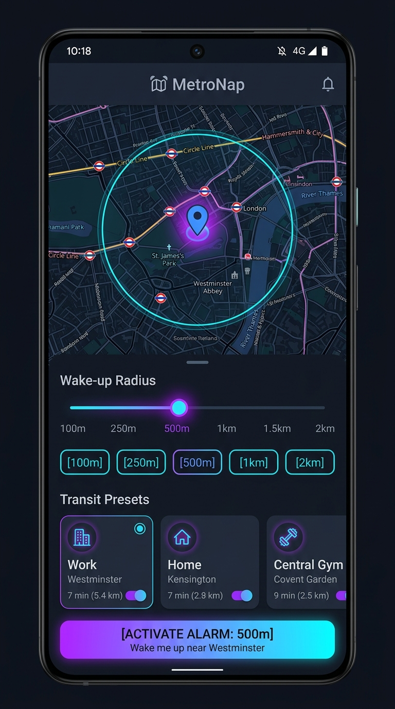

# 🗺️ MetroNap - Location-Based Transit Alarm App

[](https://kotlinlang.org/)
[](https://developer.android.com/compose)
[](https://github.com/osmdroid/osmdroid)
[](https://developer.android.com/about/versions/15)
[](https://developer.android.com/about/versions/nougat)

A modern, high-performance, and battery-optimized **Location-Based Transit Alarm App** built using **Kotlin**, **Jetpack Compose (Material 3)**, and **OSMDroid**. 

Designed for commuters, travelers, and transit riders, MetroNap runs silently in the background and alerts you with audio and vibration as you approach your destination, ensuring you never sleep past your stop again.

---

## 📱 App Interface Mockup

<p align="center">
  
</p>


## ✨ Features

- **📍 Precision Location Alarms:** Set a destination, define a proximity radius, and let the app ring and vibrate to wake you up before your arrival.
- **🗺️ OpenStreetMap & Nominatim Search:** Completely open-source mapping. Search destinations worldwide using OSM Nominatim geocoding—no Google Maps API keys or subscription required.
- **🚉 Global Transit Presets:** Quick-select popular global transit hubs (Rajiv Chowk Metro, Times Square Subway, Shibuya Station, King's Cross, etc.) for easy testing.
- **📏 Configurable Radius:** Choose warning zones from `100m`, `200m`, `500m`, `750m`, to `1000m` depending on your travel speed.
- **⚡ Battery & CPU Optimizations:**
  - **Zero-Allocation Hot Path:** Pre-allocates distance measurement structures to prevent high garbage collection (GC) churn on frequent GPS ticks.
  - **Adaptive GPS Priority:** Automatically shifts GPS requests from battery-friendly balanced-accuracy (when far away) to high-precision tracking (as you close in on the destination).
  - **Cached Services:** Local references to Android system managers are cached to eliminate IPC overhead during frequent updates.
- **🛡️ Android 15 Ready & Persistent:** Uses a robust `Foreground Service` (with specific `location` service type declarations) to keep tracking active even when your screen is off or other apps are running.

---

## 🛠️ Project Structure

The project has been organized into a clean, root-level Gradle Android structure ready for GitHub:

- **[`app/src/main/java/com/example/taskmanager/MainActivity.kt`](app/src/main/java/com/example/taskmanager/MainActivity.kt):** Houses the complete user interface logic, OSM map setup, location presets, dynamic geocoding search, and runtime permission dialogs.
- **[`app/src/main/java/com/example/taskmanager/LocationAlarmService.kt`](app/src/main/java/com/example/taskmanager/LocationAlarmService.kt):** Implements the background GPS listener, distance computation, adaptive location throttling, media playback (alarm sound), and vibration pattern executor.
- **[`app/src/main/AndroidManifest.xml`](app/src/main/AndroidManifest.xml):** Configures app parameters, location/notification permission requirements, and the foreground service configuration.
- **[`build.gradle.kts`](build.gradle.kts):** Top-level Gradle script defining build plugins.
- **[`settings.gradle.kts`](settings.gradle.kts):** Declares repository sources (Google, Maven Central) and defines modular includes.

---

## ⚙️ Setup & Installation

The easiest way to open, compile, and run this application is using **Android Studio**.

### Step 1: Clone the Repository
```bash
git clone https://github.com/YOUR_USERNAME/travel-assist.git
cd travel-assist
```

### Step 2: Open in Android Studio
1. Launch Android Studio.
2. Select **Open** and browse to the cloned `travel-assist` directory.
3. Click **OK**. Android Studio will automatically sync gradle files and download dependencies.

### Step 3: Run the App
- **Virtual Device (Emulator):** Create an emulator with API 34 or 35 via the **Device Manager** and click the green **Run** button.
- **Physical Device:** Enable Developer Options and USB Debugging on your phone, connect it via USB, select your device from the toolbar dropdown, and click **Run**.

---

## 🛡️ Permissions Required

MetroNap requests the following permissions to ensure accurate background tracking:
- `ACCESS_FINE_LOCATION` & `ACCESS_COARSE_LOCATION`: To monitor current location coordinates.
- `ACCESS_BACKGROUND_LOCATION`: Needed to continue location tracking when the screen is locked or the app is minimized.
- `FOREGROUND_SERVICE` & `FOREGROUND_SERVICE_LOCATION`: To run the persistent tracking service reliably.
- `POST_NOTIFICATIONS`: To show the service controller notification (dismiss, stop buttons) in Android 13+.
